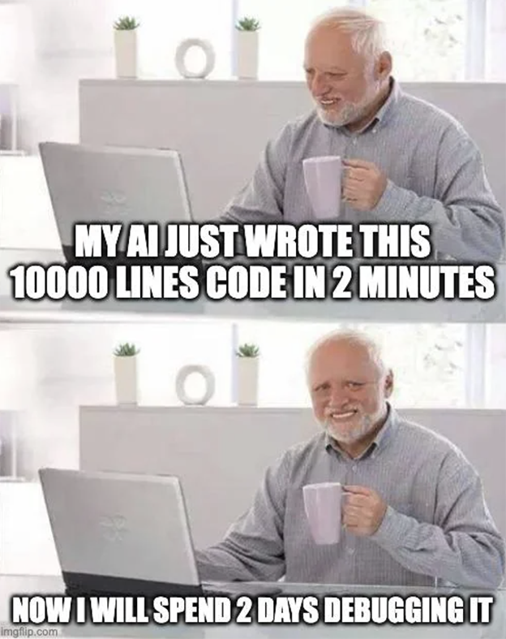

# Chapter 6: AI Use in Assignments

**If you can’t explain your code, you didn’t write it.**

Artificial Intelligence (AI) tools can help you learn, but they can also reduce your understanding if you rely on them too much. Assignments are designed to build your skills, not just produce working code.

---

## Understanding Code

Using AI to **understand code** is always acceptable acceptable. This would be the equivalent of using coding dpocumentation. 

Examples:
- Explaining code  
- Debugging errors  
- Clarifying concepts  

---

## Writing Code

Using AI to **write portions of code** is sometimes acceptable. This would be the equivalent of using coding exmaples. 

- Follow assignment guidelines  
- Make sure you understand the code  
- Be able to explain your solution  
- Cite your AI generated snippet 

---

## Generating Complete Solutions

Using AI to **generate full solutions (“vibe coding”)** is only acceptable if the assignment permits it.

- Do not submit fully AI-generated work unless allowed  
- Do not rely on AI to complete the majority of an assignment  

---

## Next Steps

Each assignment will have different rules for what existing code can be incorporated into an assignment. In the next chapter we will review how to read Assignment Academic Integrity Guidelines.

[Previous Chapter](/examples) - [Home](/) - [Next Chapter](/templates)

---

