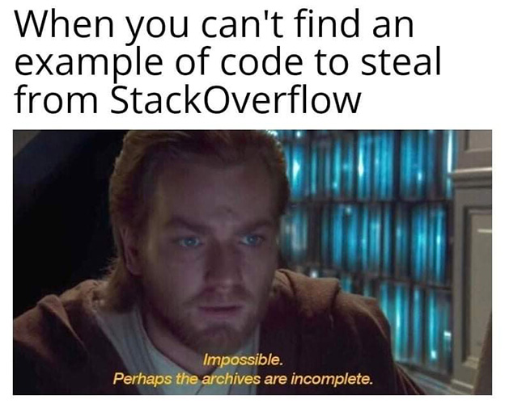

## Chapter 8: Academic Misconduct Case Studies

Below are a series of academic case studies loosely based on past events. Any names used are chosen at random.

> <small>Incomplete Archives [Digital Image]. 2020. Retrieved from [https://www.reddit.com/r/ProgrammerHumor/](https://www.reddit.com/r/ProgrammerHumor/)</small>

---

### Case Study 1: Sharing Files

#### The Situation
Navpreet and Sam are friends in the program. Sam has a lot of experience coding and Navpreet is learning how to code for the first time. Navpreet turns to Sam for help, but Sam is going to work and does not have time at that moment. The assignment is due that evening. Sam sends the finished assignment to Navpreet who has promised not to use it and only read it.

#### Why is this a Bad Situation?
By making his code available to Navpreet, Sam has given Navpreet the power to copy it and use it. Sam no longer has control of his code and is now vulnerable to the actions of someone else. If Navpreet uses any part of the code, even after editing it, plagiarism has still occurred.

#### Can it Get Any Worse?
Navpreet is still struggling to find an answer to the assignment and time is running out. As the assignment comes due Navpreet takes Sam's file, removes Sam's name and adds their own. Navpreet then submits the file as their own. The professor reads both assignments and notes that they are identical. The students receive a zero grade for the assignment and in a subsequent meeting with the Associate Dean they know that they have only a single chance left if they plagiarize again. Navpreet, a domestic student, would graduate a year later. Sam, an international student, might then lose their student visa and have to return home.

#### Solutions
Never share your code files. Once you do, you have committed academic misconduct by making them available to be copied. Talking to your fellow students and helping them verbally with their programming problems is perfectly fine.

From the other student's point of view, it is better to submit an assignment with flaws in order to continue learning. Once your assignment has been handed in, you can then talk to your professor about the assignment and find out where you went wrong. Partial marks are available for work that is submitted but not working. Much better than a zero!

---

### Case Study 2: Screen Sharing

#### The Situation
Chen and Fatima are doing homework together using Zoom. They are talking about the assignment and how the code should work. Chen is not making as much progress and so they ask Fatima if she can see her code. Fatima, knowing that sharing files is not allowed, shares her screen with Chen. Unknown to her Chen takes a screenshot of Fatima's code and later on types it out character by character.

#### Why is this a Bad Situation?
In a similar manner to the first case, Fatima has made their work available to be copied. It is no longer under their control. This is where they made their mistake. Now Chen must resist the temptation to just simply use the code they have copied.

#### Can it Get Any Worse?
Chen now has Fatima's code and the deadline is here. Chen knows enough not to use the entire amount of code and instead uses only two functions that are new. Chen submits the assignment. At this point Chen has plagiarized from the code that Fatima has made available. Unfortunately, this kind of cheating is easy to detect. In a similar fashion to the first case, the students are given a zero mark for the assignment and the incident is recorded with the College.

#### Solutions
At no point should one student give their code to another. In this case Fatima should have reasonably known that Chen would be able to copy her screen or even type from the screen and thus have their code. The risk is for the more experienced student to take shortcuts around explaining the code. Either because they are running out of time or that they do not want to offend their friend. The fact remains, do not share your code! Share your expertise and share your knowledge certainly. Your fellow student should understand that and not be offended. Even if they are, this sort of interpersonal dispute can be handled separately. The consequences of cheating are so severe that it is not worth the risk.

---

### Case Study 3: Copying Code Online

#### The Situation
Steve is new to programming and struggling with a particular assignment. Steve finds some code online that completes the assignment objectives and goes far beyond. The code is retrieved from a site with a Creative Commons license and Steve adds a proper citation.

#### Why is this a Bad Situation?
Even though Steve made sure they were allowed to copy the code and included a citation, students are not permitted to copy code that directly completes the assignment objectives.

#### Can it Get Any Worse?
The professor knows that Steve has been struggling with code. This submission does not seem consistent with Steve's other work and the majority of the code has been cited. The fact that the code goes beyond the assignment requirements leads the professor to believe that Steve did not understand the copied code enough to learn from the concepts and only integrate the necessary components. The professor asks Steve to explain the code that has been copied and Steve cannot.

#### Solutions
In this case the copied code still amounts to plagiarism. Steve receives a zero on the assignment. Steve and the professor meet with the Associate Dean and the academic misconduct is placed on Steve's academic record.

---

## Next Steps

In the next chapter we will conclude this course and provide instructions for next steps.

[Previous Chapter](/templates) - [Home](/) - [Next Chapter](/conclusion)

---

