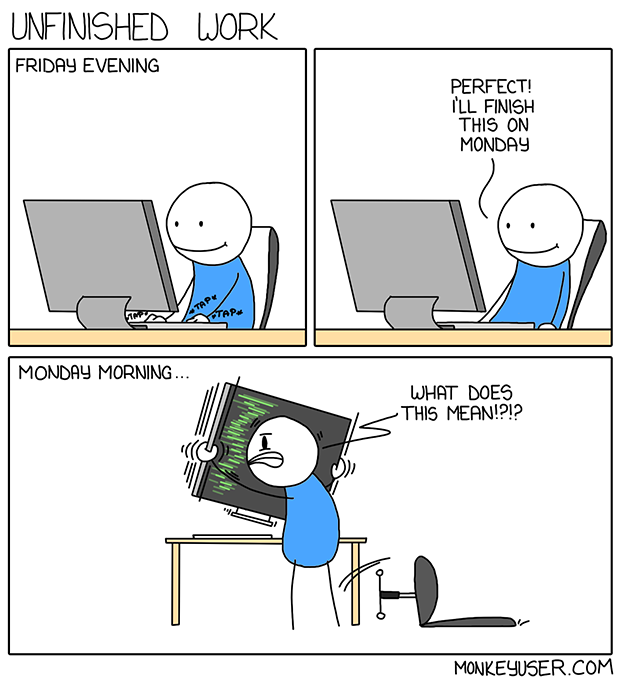

## Course Complete

**Congratulations! You have completed the academic integrity course!**

Hopefully you are comfortable with reading and applying the Assignment Academic Integrity Guidelines! If you are ever unsure, don't hesitate to reach out to your professors.

---

> <i class="fas fa-quote-left" aria-hidden="true"></i> Learning to write programs stretches your mind, and helps you think better, creates a way of thinking about things that I think is helpful in all domains. <i class="fas fa-quote-right" aria-hidden="true"></i>
> <small>Bill Gates – Co-Founder, Microsoft</small>

---

Remember, the best way to learn code is to struggle through the assignments! The instances where an `if` statement takes over an hour to get working properly or when it takes a Stack Overflow question to fix an infinite `for` loop are the times you will learn the most.

**As cliché as it sounds, cheating robs you of the best learning moments.**

Are you in this program to simply complete it? Or are you in this program to actually learn how to code?

<small>Unfinished Work [Digital Image]. 2019. Retrieved from [https://www.reddit.com/r/ProgrammerHumor/](https://www.reddit.com/r/ProgrammerHumor/)</small>

---

## Course Evaluation

To complete this course, return to Blackboard and complete the Assignment Academic Integrity Guidelines quiz located in the Assignments folder. You must receive a 100% mark on this quiz to receive a SAT (satisfactory) grade. You have as many attempts as required to complete the quiz.

---

## Next Steps

Congratulations! This course is complete. You can now return to Blackboard and complete the Academic Integrity Quiz.

[Previous Chapter](/case-studies) | [Home](/) | [Next Chapter](/)

---

