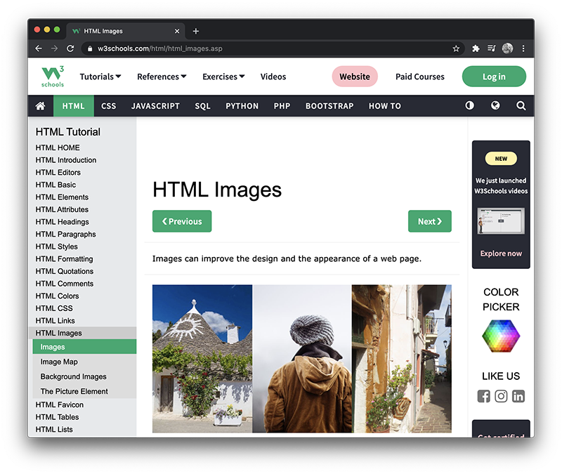
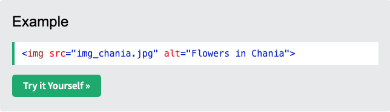
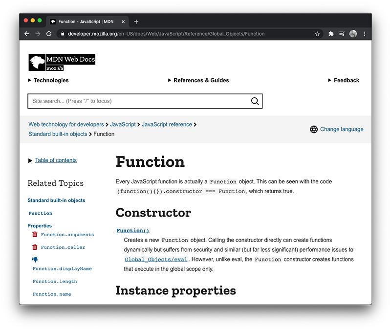
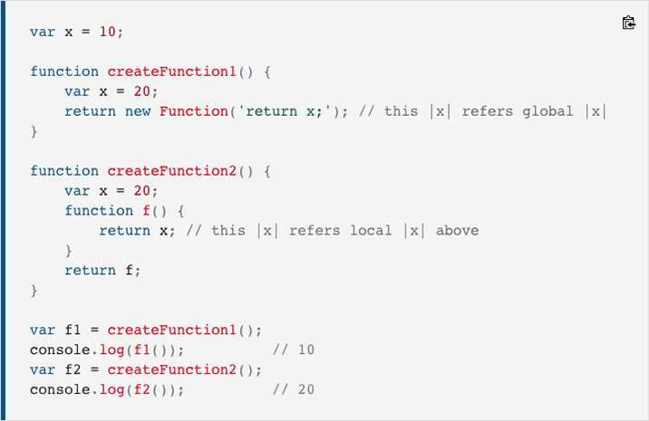
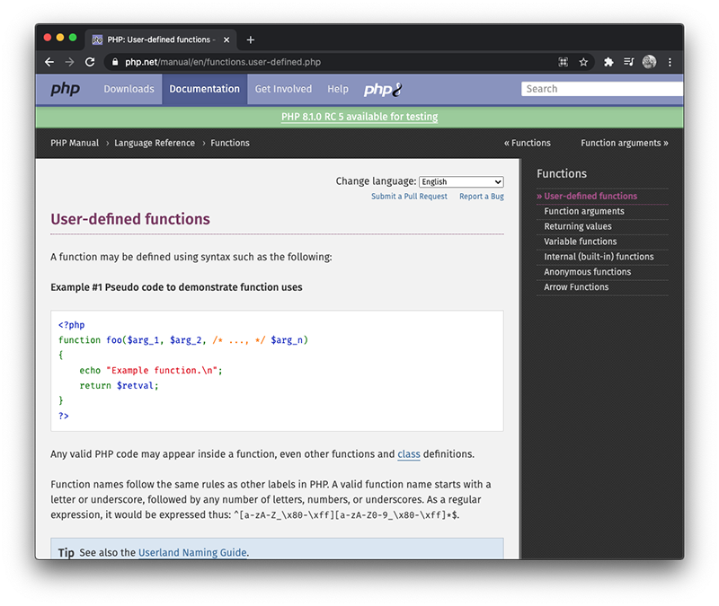
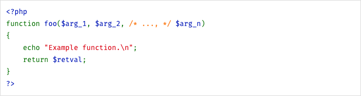
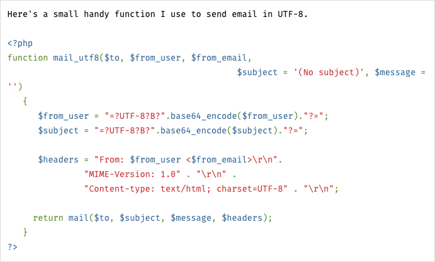

## Chapter 3: Copying Code from Documentation

Documentation used while coding is the equivalent of a dictionary used while writing an essay. It provides insight and/or snippets of individual commands, not a larger concept. Documentation may provide insight on:

- Defining a CSS selector for HTML tags
- Integrate a JavaScript `if` statement to make a decision
- Integrate a Python `for` loop to repeat code
- Set the speed of a LEGO™ EV3 motor

Copying from documentation usually involves only copying a few lines of code at a time. The copied code will not function in its copied state; it will need to be modified and/or have code added before it will achieve an objective.

Copying code from documentation does not require any citation and is permitted on almost all assignments.

However, sometimes identifying which code snippets are considered documentation and which snippets are considered examples can be difficult. To make things harder, documentation often appears on the same website as examples, and sometimes even on the same page.

---

## Coding Documentation

Below are a series of documentation snippets. The snippets include a variety of different languages and sources.

---

### Snippet 1: W3Schools and HTML

> <small>[https://www.w3schools.com/html/html_images.asp](https://www.w3schools.com/html/html_images.asp)</small>

Below is a snippet of code from the [W3Schools](https://www.w3schools.com/) page displayed above.

> <small>[https://www.w3schools.com/html/html_images.asp](https://www.w3schools.com/html/html_images.asp)</small>

This code provides documentation on how to use the `img` tag. This snippet could not be subject to copyright because it is very likely that two programmers would come up with practically the same code. Notice that the snippet has no objective (such as an [image slideshow](https://www.w3schools.com/howto/howto_js_slideshow.asp), a [hero image banner](https://www.w3schools.com/howto/howto_css_hero_image.asp), or an [image zoom tool](https://www.w3schools.com/howto/howto_js_image_zoom.asp)). These would all be considered example code snippets.

> Code from W3Schools is free to use and manipulate. It has been released under the [Fair Use License](https://www.copyright.gov/fair-use/more-info.html). More information on the terms of use is available on the [W3Schools](https://www.w3schools.com/about/about_copyright.asp) website.

---

### Snippet 2: MDN and JavaScript

> <small>[https://developer.mozilla.org/en-US/docs/Web/JavaScript/Reference/Global_Objects/Function](https://developer.mozilla.org/en-US/docs/Web/JavaScript/Reference/Global_Objects/Function)</small>

Below is a JavaScript code snippet from the [Mozilla Developer Network](https://developer.mozilla.org/) page displayed above. This code provides documentation on how to define a function:

> <small>[https://developer.mozilla.org/en-US/docs/Web/JavaScript/Reference/Global_Objects/Function](https://developer.mozilla.org/en-US/docs/Web/JavaScript/Reference/Global_Objects/Function)</small>

This snippet could not be copyrighted because it is very likely that two programmers would come up with practically the same code. It is also unlikely that this code could even be used in a project, as the code is simply an empty shell of a function definition that still needs to be given a proper name and additional code to achieve a purpose.

> Code from the [Mozilla Developer Network](https://www.mozilla.org/) website is licensed under the [Creative Commons Attribution](https://creativecommons.org/licenses/by/4.0/). More information on the terms of use is available on the [Mozilla Developer Network](https://www.mozilla.org/en-US/foundation/licensing/) website.

---

### Snippet 3: PHP

> <small>[https://www.php.net/manual/en/functions.user-defined.php](https://www.php.net/manual/en/functions.user-defined.php)</small>

Below is a PHP code snippet from [php.net](https://www.php.net/manual/en/functions.user-defined.php). This code provides the syntax for user-defined functions:

> <small>[https://www.php.net/manual/en/functions.user-defined.php](https://www.php.net/manual/en/functions.user-defined.php)</small>

Like the JavaScript snippet, this code is still lacking any purpose. It is an empty shell ready to be copied into a project and customized.

However, on the same website, below the documentation, is a series of user contributed code snippets:

> <small>[https://www.php.net/manual/en/function.mail.php](https://www.php.net/manual/en/function.mail.php)</small>

The above code is a function that can be used to send a UTF-8 formatted email using PHP. Assuming the assignment allows the use of code examples, this code is subject to copyright and must include a citation.

> Code from the [PHP](https://www.php.net/) website is free to use under the [Creative Commons Attribution License](https://creativecommons.org/licenses/by/3.0/).

---

## Next Steps

In the next chapter we will review the use of online coding examples and how to incorporate code from these sources into student work.

[Previous Chapter](/citing) - [Home](/) - [Next Chapter](/examples)

---

