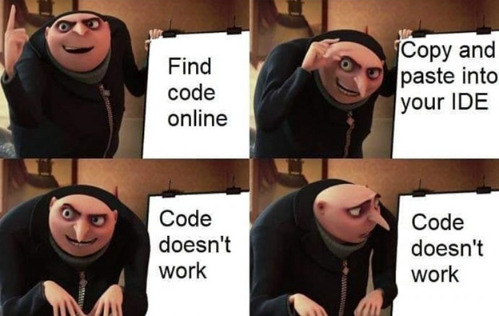
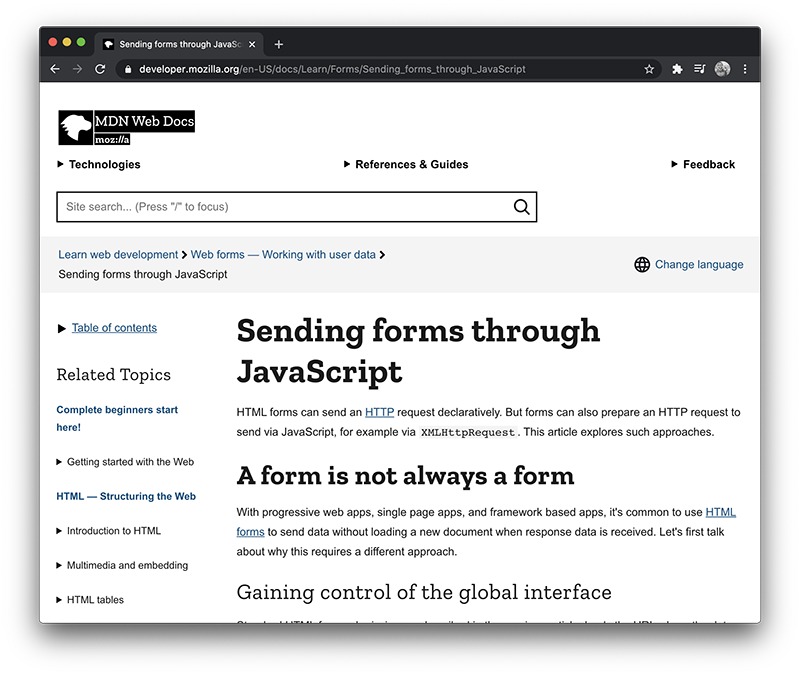
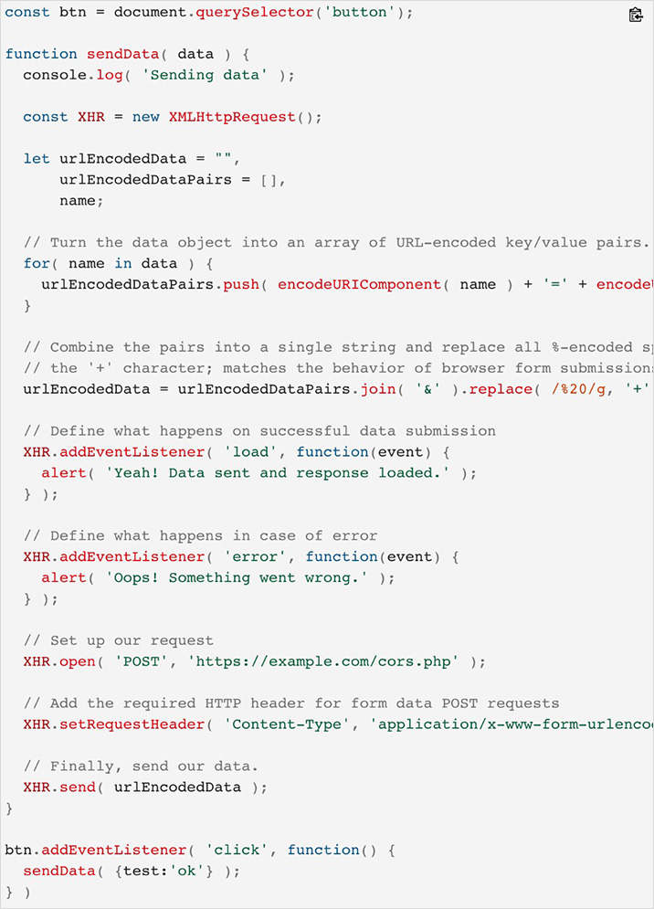
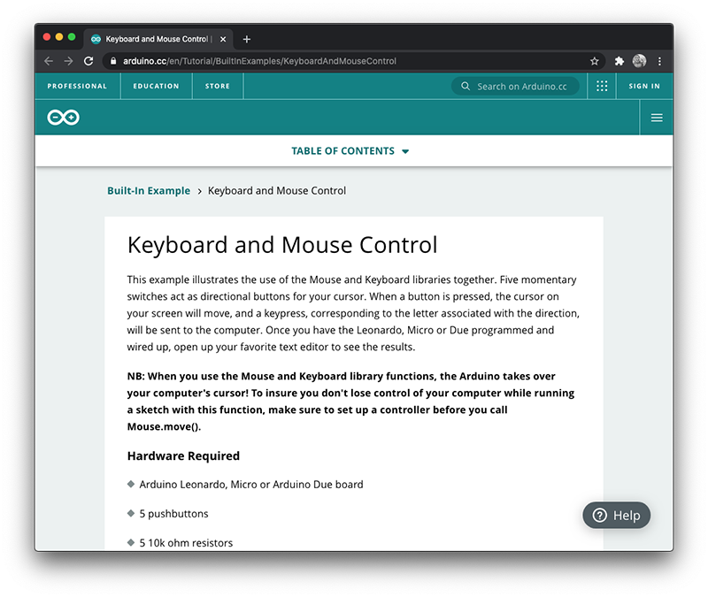
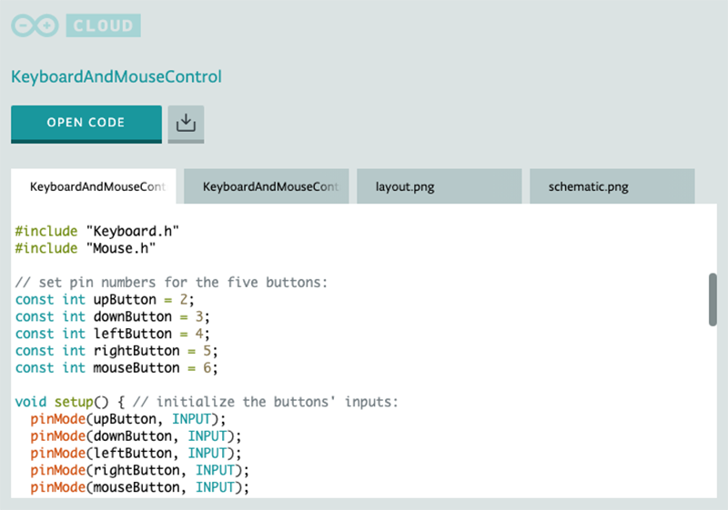
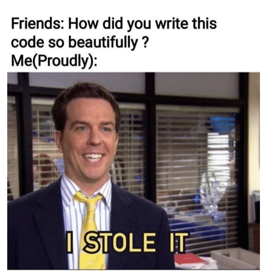

## Chapter 4: Copying Code from Examples

Examples used while coding are the equivalent of copying a paragraph from a paper or book while writing an essay. Copying content from another literature source is often permitted, but must be done properly and with a citation. Example code snippets provide working code that completes a larger objective. For example, coding examples may include code that:

- Uses JavaScript to add a slideshow on a webpage
- Submits form content to an email address using PHP
- Uses Python to add password protection to an application
- Causes a LEGO™ EV3 robot to follow a line

Copying code from examples will require permission (either from the author or the website license), a citation, and must fall within the assignment academic integrity guidelines (which we will review in the next chapter). Also, the code that you are copying must not be part of the assignment requirements. You will not receive academic credit for code that you did not write.

Students must also be able to demonstrate an understanding of the copied code upon request.

Code examples are easier to identify as they are ready to use and will often work directly after pasting them into a project.

---

> <small>Code Doesn't Work [Digital Image]. 2019. Retrieved from [https://www.reddit.com/r/ProgrammerHumor/](https://www.reddit.com/r/ProgrammerHumor/)</small>

---

## Coding Examples

Below are a series of example snippets. The examples include a variety of different languages and sources.

---

### Example 1: MDN and JavaScript

> <small>[https://developer.mozilla.org/en-US/docs/Learn/Forms/Sending_forms_through_JavaScript](https://developer.mozilla.org/en-US/docs/Learn/Forms/Sending_forms_through_JavaScript)</small>

Below is a snippet of code from the [Mozilla Developer Network](https://developer.mozilla.org/) page displayed above.

> <small>[https://developer.mozilla.org/en-US/docs/Learn/Forms/Sending_forms_through_JavaScript](https://developer.mozilla.org/en-US/docs/Learn/Forms/Sending_forms_through_JavaScript)</small>

This code provides an example of how to send form data using a `XMLHttpRequest`. This is a working example that just needs to be customized to suit a project's specific needs. This example would be subject to copyright and would need to be cited (assuming the assignment the student is working on permits the use of examples).

> Code from the [Mozilla Developer Network](https://www.mozilla.org/) website is licensed under the [Creative Commons Attribution](https://creativecommons.org/licenses/by/4.0/). More information on the terms of use is available on the [Mozilla Developer Network](https://www.mozilla.org/en-US/foundation/licensing/) website.

---

### Example 2: Arduino and a Keyboard

> <small>[https://www.arduino.cc/en/Tutorial/BuiltInExamples/KeyboardAndMouseControl](https://www.arduino.cc/en/Tutorial/BuiltInExamples/KeyboardAndMouseControl)</small>

Below is an Arduino code snippet from the [Arduino](https://www.arduino.cc/) page displayed above.

> <small>[https://www.arduino.cc/en/Tutorial/BuiltInExamples/KeyboardAndMouseControl](https://www.arduino.cc/en/Tutorial/BuiltInExamples/KeyboardAndMouseControl)</small>

This code provides a sample of how to incorporate keyboard input using buttons and an Arduino. This snippet and circuit are a working example and ready to be customized for a specific project.

> Code from the [Arduino](https://www.arduino.cc/) website is free to use under the [Creative Commons](https://creativecommons.org/).

> <small>I Stole It [Digital Image]. 2020. Retrieved from [https://www.reddit.com/r/ProgrammerHumor/](https://www.reddit.com/r/ProgrammerHumor/)</small>

---

## Copying Code from Other Students

Copying code from other students follows the same academic guidelines as copying code from an online source. You will need permission from the author, copying from examples must be within the Assignment Academic Integrity Guidelines (which we will review in the next chapter), the code must include a citation, and the code that you are copying must not be part of the assignment objective.

In addition, you must receive permission from your professor when copying code from a fellow student.

---

### Copying Code Without Permission

Copying code from a fellow student without permission is considered plagiarism. A single infraction will result in the same academic penalties as copying code from an online source. However, in this case both the student who copied the code and the student who provided the code will be charged with academic misconduct.

**Do not under any circumstances, provide students with a copy of your code.**

When helping fellow students, be careful not to share your code, either by sharing files or sharing your screen. It is best to help your fellow students by reviewing their code, offering verbal suggestions, and/or providing links to helpful resources.

---

## Next Steps

In the next chapter we will review the use of coding libraries, frameworks, packages, and programmer resources.

[Previous Chapter](/documentation) - [Home](/)- [Next Chapter](/libraries-frameworks)

---

