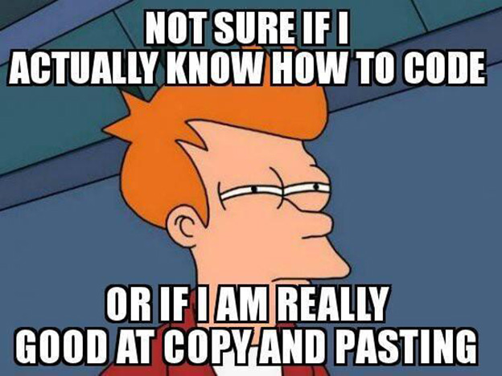

## Coding and Plagiarism

An online course focussing on academic integrity in computer science.

## About this Course

**Writing code for academic purposes is similar to all academic writing in that students are required to follow similar guidelines.**

However, identifying what is and what isn't academic misconduct when writing code, assisting fellow students, searching for code samples online, or utilizing online code samples can be difficult. This is because academic guidelines related to writing code will vary in each course and occasionally in each assignment. Additionally, the expectations of a programmer during academia are dramatically different than the industry.

This course will outline those guidelines and require students to complete a series of quizzes to ensure the guidelines are understood.

> <small>Copy and Paste [Digital Image]. 2019. Retrieved from https://www.reddit.com/r/ProgrammerHumor/</small>

---

## Course Syllabus

1. **Course Introduction**

    A brief course introduction including a definition of academic misconduct related to writing code, the effects of academic misconduct on students, and a glossary of terms important to understand to complete this course.

    [View this Chapter](/introduction)

2. **Citing Code**

    Guidelines and examples on how to cite code in student source code.

    [View this Chapter](/citing)

3. **Copying Code from Documentation**

    Instructions on how to identify online documentation and examples of incorporating code retrieved from documentation into student work.

    [View this Chapter](/documentation)

4. **Copying Code from Examples**

    Instructions on how to identify what code is considered an example and how to incorporate examples into student work.

    [View this Chapter](/examples)

5. **Libraries and Frameworks**
    
    Guidelines on using existing code libraries, frameworks, and packages in student work.

    [View this Chapter](/libraries-frameworks)

8. **Artificial Intelligence**

    Guidelines on using artificial intellingce cuch as ChatGPT and Claude in student work.

    [View this Chapter](/ai)

7. **Assignment Templates**

    Examples and how to read Assignment Academic Integrity Guidelines.

    [View this Chapter](/templates)

8. **Academic Misconduct Case Studies**

    A selection of sample case studies related to academic misconduct.

    [View this Chapter](/case-studies)
    
9. **Conclusion**

    Conclusion and instructions for next steps.

    [View this Chapter](/conclusion)

--resources--

---

