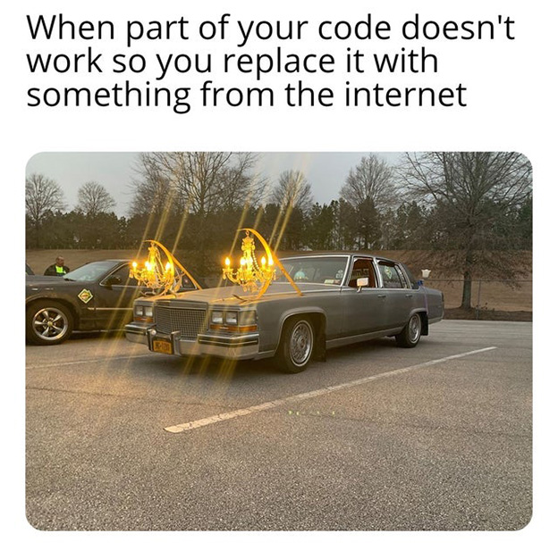
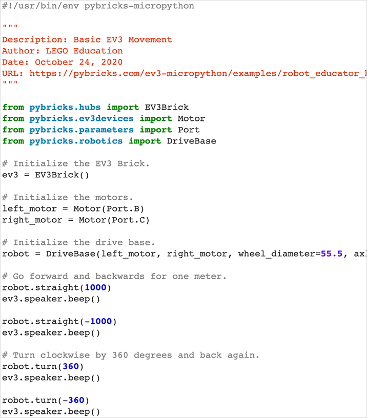
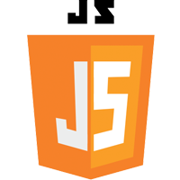
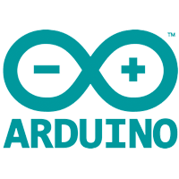
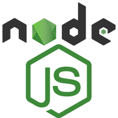

# Chapter 7: Assignment Templates

As an author, in academia or industry, copying content from an article or novel without permission and/or a citation is always plagiarism.

However, in the programming industry copying is often permitted, and sometimes even preferred. Why program something from scratch when there is an existing solution that has been used, tested, and patched?

While programming in academia, students will learn programming fundamentals by coding everything from scratch, and as the program progresses, students will learn to integrate more and more prewritten code into projects. For that reason, every coding assignment will include a set of Assignment Academic Integrity Guidelines. These guidelines will outline what use of prewritten code is permitted for each assignment.

> <small>Part of Your Code Doesn't Work [Digital Image]. 2020. Retrieved from [https://www.reddit.com/r/ProgrammerHumor/](https://www.reddit.com/r/ProgrammerHumor/)

---

## Sample Academic Integrity Guidelines

Below are a few samples of Assignment Academic Integrity Guidelines:

---

### Example 1: Introduction Assignment

Below are the guidelines for an introduction to JavaScript assignment. The assignment requires students to code an HTML/CSS contact form, add validation using JavaScript, and submit the form contents to an email address using AJAX and an API.

  

| Permitted? | Guideline |
|---|---|
| ☑️ | Copying sample code from coding documentation such as sample variable definitions, for loops, function definitions, etc... |
| ⬜ | Copying a functional block of code. Citations and understanding are required. |
| ⬜ | Use of coding frameworks and/or libraries. |

The above guidelines for this introductory assignment permit students to copy code from documentation only.

---

### Example 2: Intermediate Assignment

Below are the guidelines for an intermediate PHP assignment. The assignment requires students to build a basic Content Management System (CMS). The CMS admin must be password protected and provide the ability to manage admin accounts and blog articles.

 

| Permitted? | Guideline |
|---|---|
| ☑️ | Copying sample code from coding documentation such as sample variable definitions, for loops, function definitions, etc... |
| ☑️ | Copying a functional block of code. Citations and understanding are required. |
| ⬜ | Use of coding frameworks and/or libraries. |

The above guidelines permit the copying of code from documentation and code examples. Students could copy code examples that help upload images, encrypt passwords, validate form data, but not copy an existing CMS example. Students must still gain permission from the author or license, include a citation, and demonstrate an understanding of the copied code if requested.

---

### Example 3: Advanced Assignment

Below are the guidelines for an advanced Arduino and Node.js assignment. The assignment requires students to build a basic circuit using an Arduino and then connect the Arduino to a Node.js application using the serial port.

 

| Permitted? | Guideline |
|---|---|
| ☑️ | Copying sample code from coding documentation such as sample variable definitions, for loops, function definitions, etc... |
| ☑️ | Copying a functional block of code. Citations and understanding are required. |
| ☑️ | Use of coding frameworks and/or libraries. Permitted libraries/frameworks: Socket.io, SerialPort |

The above guidelines permit the copying of code from documentation and examples and the use of two libraries: [Socket.io](https://socket.io/) and [SerialPort](https://www.npmjs.com/package/serialport).

---

## Next Steps

In the next chapter we will review a series of academic misconduct case studies and their academic penalties.

[Previous Chapter](/ai) - [Home](/) - [Next Chapter](/case-studies)

---

