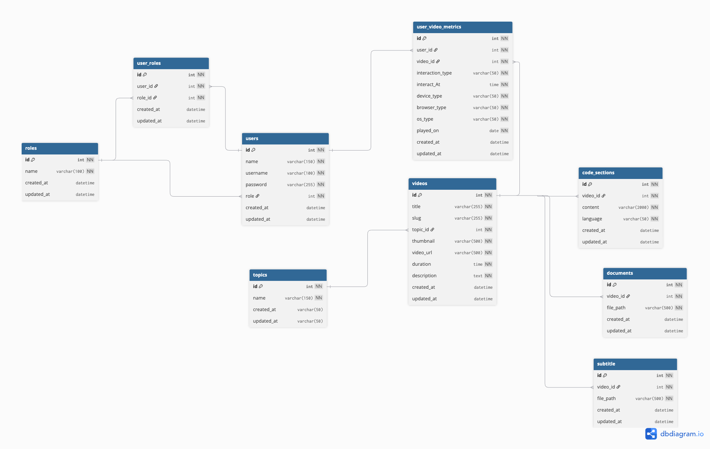

# ONLINE - VIDEO BASED LEARNING PLATFORM 

## 1. INNER JOIN
```sql
-- Check how many students has watch this video and what is the total watch hour for the video
SELECT v.title AS 'Title',COUNT(*) AS 'Total Watch', SEC_TO_TIME(SUM(TIME_TO_SEC(v.duration))) AS 'Total Duration' from user_video_metrics as m INNER JOIN users as u ON u.id = m.user_id INNER JOIN videos as v ON v.id = m.video_id WHERE m.video_id =1;

-- Output table
| title           | Total Watch | Total Duration |
|-----------------|-------------|----------------|
| Intro to Python | 1           | 00:45:00       |
```
```sql
-- Check for one user
SELECT u.id AS id, u.name AS Name ,COUNT(*) as 'Total Watch',  SEC_TO_TIME(SUM(TIME_TO_SEC(v.duration))) AS 'Total Duration' FROM user_video_metrics as m INNER JOIN users as u ON u.id = m.user_id INNER JOIN videos AS v ON v.id = m.video_id WHERE u.id = 1;

-- Output table
| Name           | Total Watch | Total Duration |
|----------------|-------------|----------------|
| Rinzin         | 3            | 00:25:60      |

```

## 2. INSERT STATEMENT

```sql
-- Insert new topic
INSERT INTO `topics` (`name`, `created_at`)
VALUES ('Database Design', NOW());
```

```sql
-- Insert new Video
INSERT INTO `videos` (`title`, `slug`, `topic_id`, `thumbnail`, `video_url`, `duration`, `description`, `created_at`, `updated_at`)
VALUES (
  'Database Design',
  'database-design',
  51,
  'https://cdn.example.com/thumb/051.jpg',
  'https://cdn.example.com/video/051.mp4',
  '01:00:00',
  'Build database schema.',
  NOW(),
  NOW()
);
```

## 3. UPDATE STATEMENT

```sql
-- Update Topics
UPDATE topics
SET name = 'Database Design Course'
WHERE id = 1;
```

```sql
-- Update videos
UPDATE videos
Set thumbnail = 'image'
WHERE id = 1;
```

## 4. VIEW STATEMENT

```sql
-- View for the video and topics
CREATE VIEW `video_with_topic` AS
SELECT
    v.id,
    v.title,
    v.slug,
    t.name AS topic_name,
    v.duration,
    v.description,
    v.thumbnail,
    v.video_url,
    v.created_at
FROM `videos` v
JOIN `topics` t ON v.topic_id = t.id;
```

```sql
-- We can select from this new view
SELECT * FROM `video_with_topic` WHERE id = 2;
```

## 5 . CUSTOM FUNCTION

```sql
DELIMITER $$

CREATE FUNCTION `get_video_stats`(p_video_id INT)
RETURNS VARCHAR(100)
DETERMINISTIC
BEGIN
    DECLARE v_count INT;
    DECLARE v_total TIME;

    SELECT COUNT(*) INTO v_count
    FROM user_video_metrics
    WHERE video_id = p_video_id;

    SELECT SEC_TO_TIME(SUM(TIME_TO_SEC(interact_At))) INTO v_total
    FROM user_video_metrics
    WHERE video_id = p_video_id;

    RETURN CONCAT('Total Interactions: ', v_count, ' | Total Watch Duration: ', v_total);
END$$

DELIMITER ;

-- function
SELECT get_video_stats(1);

```

### DATABASE ERD - DIAGRAM


